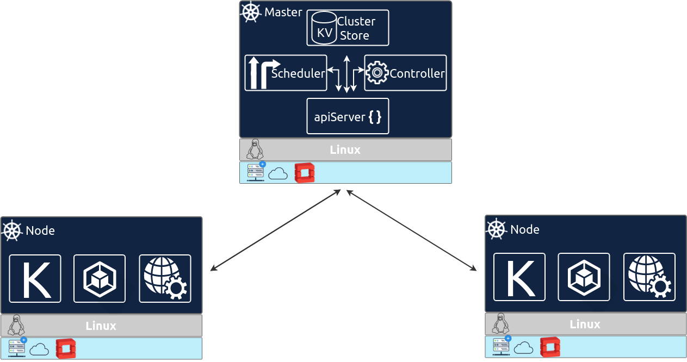

# Kubernetes Architecture

From a physical perspective, a Kubernetes cluster consists of:

1. A master \(with several independent sub-components, details below\) that coordinates the work.
2. A distributed key-value store, currently etcd, for maintaining the resource state in a persistent and reliable manner, throughout the cluster.
3. A number of nodes that carry out the work.

