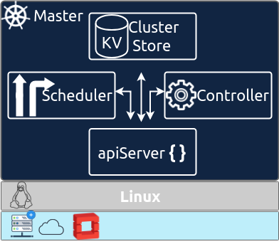

# Master Node

Masters acts as the primary **control plane** for kubernetes. 

Kubernetes system components communicate only with the API server. They don’t talk to each other directly. The API server is the only component that communicates with etcd. None of the other components communicate with etcd directly, but instead modify the cluster state by talking to the API server.

The Control Plane is what controls and makes the whole cluster function.The components that make up the Control Plane are

* The etcd distributed persistent storage
* The API server
* The Scheduler
* The Controller Manager

**Add-on components**

Beside the Control Plane components and the components running on the nodes,

* The Kubernetes DNS server
* The Dashboard
* An Ingress controller
* The Container Network Interface network plugin 

