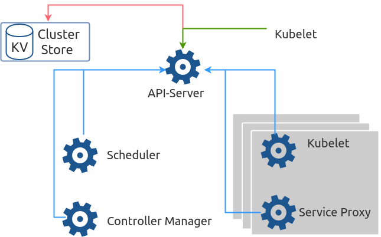

# kube-apiserver

The **apiserver** provides a forward facing Rest Interface into the kubernetes control planes & datastore. All Clients, including the nodes, users & other application interact with kubernetes strictly through the API Server.

It is the true core of kubernetes acting as the gatekeeper to the cluster by handling authentication & authorization, request validation, mutation & admission control in addition to being the front end to the backing data store \(**etcd**\).

