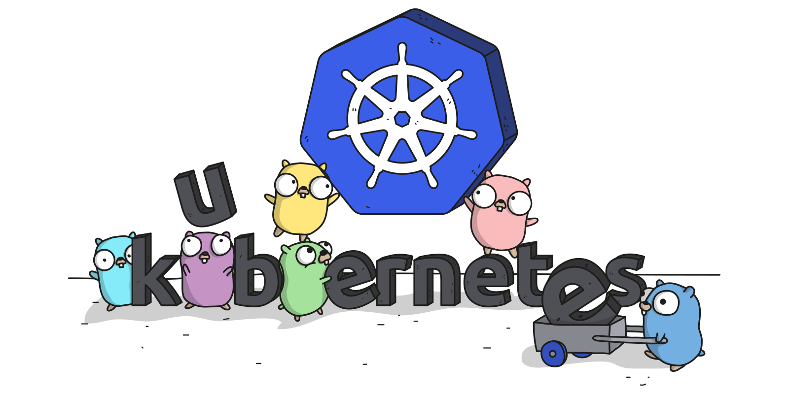

# What Is Kubernetes?

* **Kubernetes is the linux kernel of distributed systems**
* **Kubernetes is the linux of the cloud!**
* **Kubernetes is a platform and container orchestration tool for automating deployment, scaling, and operations of application containers.**
* **Kubernetes supports Containerd \(docker\), Rkt, Cri-o containers**

An ecosystem of plug-ins for scheduling, storage & networking

Manage applications , not machines

